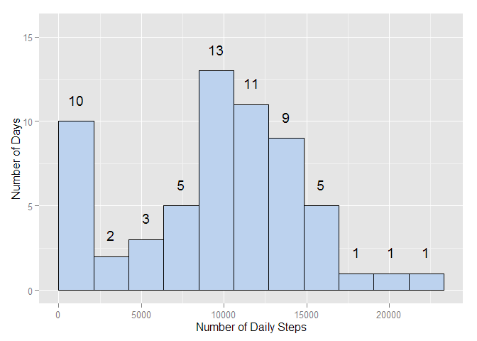
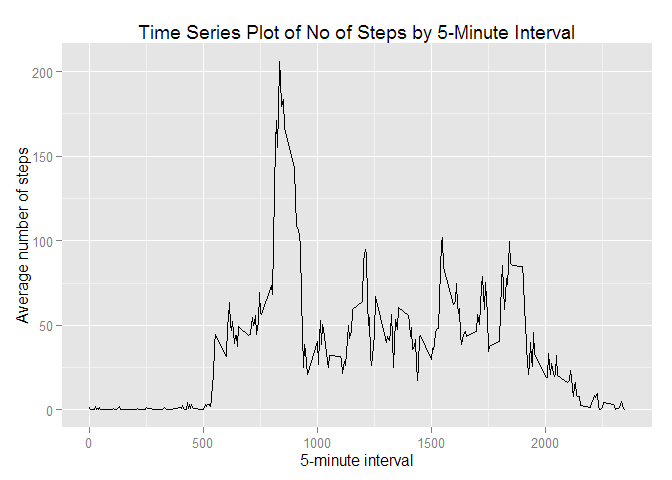
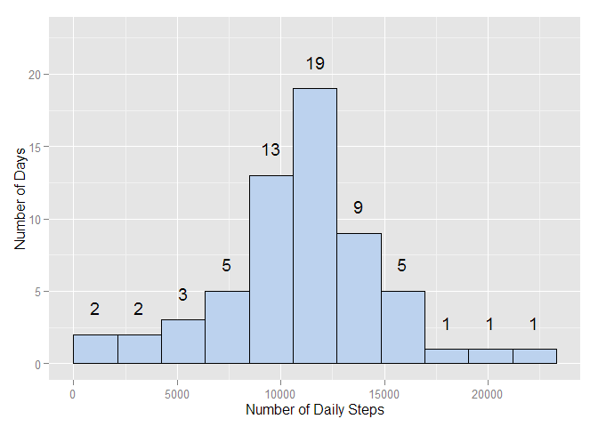
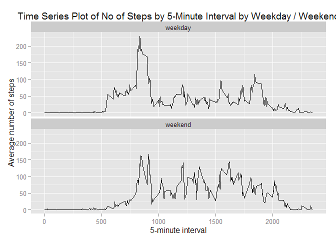

# Reproducible Research: Peer Assessment 1

## Introduction

It is now possible to collect a large amount of data about personal movement using activity monitoring devices such as a Fitbit, Nike Fuelband, or Jawbone Up. These type of devices are part of the "quantified self" movement - a group of enthusiasts who take measurements about themselves regularly to improve their health, to find patterns in their behavior, or because they are tech geeks. But these data remain under-utilized both because the raw data are hard to obtain and there is a lack of statistical methods and software for processing and interpreting the data.

This assignment makes use of data from a personal activity monitoring device. This device collects data at 5 minute intervals through out the day. The data consists of two months of data from an anonymous individual collected during the months of October and November, 2012 and include the number of steps taken in 5 minute intervals each day.

## Data

The data for this assignment can be downloaded from the course web site:

* Dataset: Activity monitoring data [52K]

The variables included in this dataset are:

* steps: Number of steps taking in a 5-minute interval (missing values are coded as NA)

* date: The date on which the measurement was taken in YYYY-MM-DD format

* interval: Identifier for the 5-minute interval in which measurement was taken

The dataset is stored in a comma-separated-value (CSV) file and there are a total of 17,568 observations in this dataset.

## Loading and preprocessing the data

We will start by clearing the environment ready for our new analysis, loading the data, and taking a quick look at the loaded dataset


```r
rm(list=ls())
library(dplyr)
```

```
## 
## Attaching package: 'dplyr'
## 
## The following objects are masked from 'package:stats':
## 
##     filter, lag
## 
## The following objects are masked from 'package:base':
## 
##     intersect, setdiff, setequal, union
```

```r
library(ggplot2)
activity<-read.csv("C:/Users/Michael/Desktop/R Working Directory/activity.csv", header = TRUE)
head(activity)
```

```
##   steps       date interval
## 1    NA 2012-10-01        0
## 2    NA 2012-10-01        5
## 3    NA 2012-10-01       10
## 4    NA 2012-10-01       15
## 5    NA 2012-10-01       20
## 6    NA 2012-10-01       25
```


## What is mean total number of steps taken per day?

##### Make a histogram of the total number of steps taken each day

Next we will summarise the number of steps taking for each day using the summarise() function from the dplyr package, and use the summarised data to produce a histogram with ggplot2. 


```r
dailysteps <- activity %>%
  group_by(date)%>%
  summarise(steps = sum(steps, na.rm=TRUE))

binsize <- diff(range(dailysteps$steps))/10 # create variable to create 10 bins

ggplot(dailysteps, aes(x=steps, ymax = max(..count..)*1.2))+
  geom_histogram(binwidth = binsize, fill = "lightsteelblue2", colour = "black", origin = 0)+
  xlab("Number of Daily Steps")+
  ylab("Number of Days")+
  stat_bin(binwidth=binsize, geom="text", aes(label=..count..), vjust=-1.5, origin = 0) 
```

 

##### Calculate and report the mean and median total number of steps taken per day

And now we will take a look at the mean and the median total number of steps taken per day using the mean() and median() functions as arguments to the summarise() function.


```r
summarise(dailysteps, Mean = mean(steps, na.rm = TRUE), Median = median(steps, na.rm = TRUE))
```

```
## Source: local data frame [1 x 2]
## 
##      Mean Median
##     (dbl)  (int)
## 1 9354.23  10395
```

## What is the average daily activity pattern?

###### Make a time series plot of the 5-minute interval (x-axis) and the average number of steps taken, averaged across all days (y-axis)

We can take a look at the daily pattern of activity by creating a time series plot of the 5-minute intervals and the average number of steps taken across all days. We start by using summarise() again, this time to add up the values in the "steps" variable (x) within each 5-minute interval subgroup (y). We use the head() function to take a look at the new variable created, and then use the ggplot() function to create the time series plot. 


```r
intsteps <- activity %>%
  group_by(interval)%>%
  summarise(steps = mean(steps, na.rm = TRUE))

head(intsteps)
```

```
## Source: local data frame [6 x 2]
## 
##   interval     steps
##      (int)     (dbl)
## 1        0 1.7169811
## 2        5 0.3396226
## 3       10 0.1320755
## 4       15 0.1509434
## 5       20 0.0754717
## 6       25 2.0943396
```

```r
ggplot(intsteps, aes(x = interval, y = steps))+
  geom_line()+
  xlab("5-minute interval")+
  ylab("Average number of steps")+
  ggtitle("Time Series Plot of No of Steps by 5-Minute Interval")
```

 

###### Which 5-minute interval, on average across all the days in the dataset, contains the maximum number of steps?

We can subset the data using the which.max() function to identify the 5-minute interval which, on average across all the days, contains the maximum number of steps. The code will return the name of the 5-minute interval and the average number of steps per day for that interval. 


```r
intsteps$interval[which.max(intsteps$steps)]
```

```
## [1] 835
```

## Imputing missing values

Note that there are a number of days/intervals where there are missing values (coded as NA). The presence of missing days may introduce bias into some calculations or summaries of the data.

###### Calculate and report the total number of missing values in the dataset (i.e. the total number of rows with NAs)

###### Devise a strategy for filling in all of the missing values in the dataset. The strategy does not need to be sophisticated. For example, you could use the mean/median for that day, or the mean for that 5-minute interval, etc.

To address the potential bias of missing values, we can replace the Na values with the mean for that particular 5-minute interval. 
###### Create a new dataset that is equal to the original dataset but with the missing data filled in.

A simple way of replacing missing values with the mean values for that particular interval is to take a copy of the summarised intsteps data created above, which contains the mean for every interval. By merging this with the main dataset, we can then replace the steps variable with the avg_steps variable where the steps variable is NA. Finally, we can produced a summary dataset (dailystepsnoNA) that summarises the mean values for very interval, ready fo the next stage of the analysis. 


```r
intsteps2 <- intsteps
names(intsteps2) <- c("interval", "avg_steps")
activity_merge <- merge(activity, intsteps2, by = "interval", all.x = TRUE)
activitynoNA <- activity_merge
activitynoNA$steps[is.na(activitynoNA$steps)] = activitynoNA$avg_steps[is.na(activitynoNA$steps)]

dailystepsnoNA <- activitynoNA %>%
  group_by(date)%>%
  summarise(steps = sum(steps, na.rm=TRUE))
```

###### Make a histogram of the total number of steps taken each day and Calculate and report the mean and median total number of steps taken per day. Do these values differ from the estimates from the first part of the assignment? What is the impact of imputing missing data on the estimates of the total daily number of steps?

We can now create a histogram to show the number of daily steps, and use the mean() and median() functions as arguments to the summarise() function to show the new mean and median, which we can compare with the mean and median originally calculated. 


```r
binsize <- diff(range(dailysteps$steps))/10 # create variable to create 10 bins

ggplot(dailystepsnoNA, aes(x=steps, ymax = max(..count..)*1.2))+
  geom_histogram(binwidth = binsize, fill = "lightsteelblue2", colour = "black", origin = 0)+
  xlab("Number of Daily Steps")+
  ylab("Number of Days")+
  stat_bin(binwidth=binsize, geom="text", aes(label=..count..), vjust=-1.5, origin = 0) 
```

 

```r
# Original mean and median
summarise(dailysteps, Mean = mean(steps, na.rm = TRUE), Median = median(steps, na.rm = TRUE))
```

```
## Source: local data frame [1 x 2]
## 
##      Mean Median
##     (dbl)  (int)
## 1 9354.23  10395
```

```r
# Mean and median with NAs replaced with mean values
summarise(dailystepsnoNA, Mean = mean(steps, na.rm = TRUE), Median = median(steps, na.rm = TRUE))
```

```
## Source: local data frame [1 x 2]
## 
##       Mean   Median
##      (dbl)    (dbl)
## 1 10766.19 10766.19
```

## Are there differences in activity patterns between weekdays and weekends?

###### Create a new factor variable in the dataset with two levels - "weekday" and "weekend" indicating whether a given date is a weekday or weekend day.

To create a new factor variable indicating whether the date is a weekday or a weekend, we can create a new function "daytype()", using the weekdays() function. This function will return the result either "weekday" or "weekend", dependent on the output from the weekdays() function. We then use sapply() to assign the returned value to a new "day" variable within the activitynoNA dataframe. Finally, we use the summary() function to inspect the dataframe. 


```r
daytype<-function(date){
  day<-weekdays(date)
  if (day %in% c("Monday", "Tuesday", "Wednesday", "Thursday", "Friday"))
      return("weekday")
  else if (day %in% c("Saturday", "Sunday"))
      return("weekend")
}
activitynoNA$date<-as.Date(activitynoNA$date)
activitynoNA$day<-sapply(activitynoNA$date, FUN = daytype)
activitynoNA$day<-as.factor(activitynoNA$day)
summary(activitynoNA)
```

```
##     interval          steps             date              avg_steps      
##  Min.   :   0.0   Min.   :  0.00   Min.   :2012-10-01   Min.   :  0.000  
##  1st Qu.: 588.8   1st Qu.:  0.00   1st Qu.:2012-10-16   1st Qu.:  2.486  
##  Median :1177.5   Median :  0.00   Median :2012-10-31   Median : 34.113  
##  Mean   :1177.5   Mean   : 37.38   Mean   :2012-10-31   Mean   : 37.383  
##  3rd Qu.:1766.2   3rd Qu.: 27.00   3rd Qu.:2012-11-15   3rd Qu.: 52.835  
##  Max.   :2355.0   Max.   :806.00   Max.   :2012-11-30   Max.   :206.170  
##       day       
##  weekday:12960  
##  weekend: 4608  
##                 
##                 
##                 
## 
```

###### Make a panel plot containing a time series plot (i.e. type = "l") of the 5-minute interval (x-axis) and the average number of steps taken, averaged across all weekday days or weekend days (y-axis).

Here we use the summarise() function again to aggregate the average number of steps by interval and day We can then produce a panelled line plot for each of the two groups (Weekday and Weekend) to compare the differences for weekdays and weekends, using the facet_wrap function within ggplot2. 


```r
averages <- activitynoNA %>%
  group_by(day, interval)%>%
  summarise(Mean = mean(steps))

ggplot(averages, aes(x = interval, y = Mean))+
  geom_line()+
  xlab("5-minute interval")+
  ylab("Average number of steps")+
  ggtitle("Time Series Plot of No of Steps by 5-Minute Interval by Weekday / Weekend")+
  facet_wrap(~day, ncol=1)
```

 


